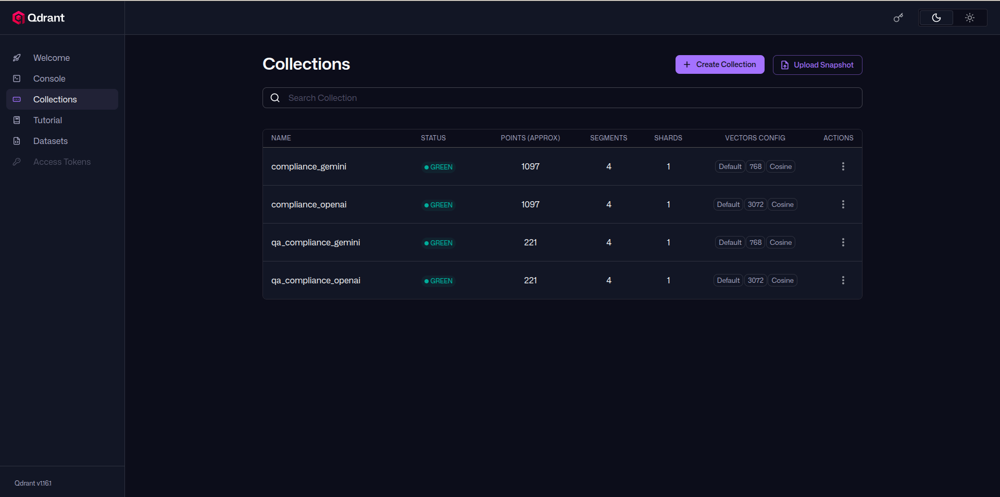
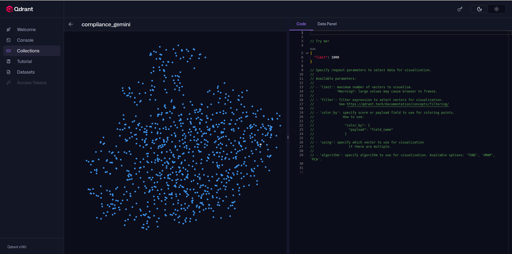
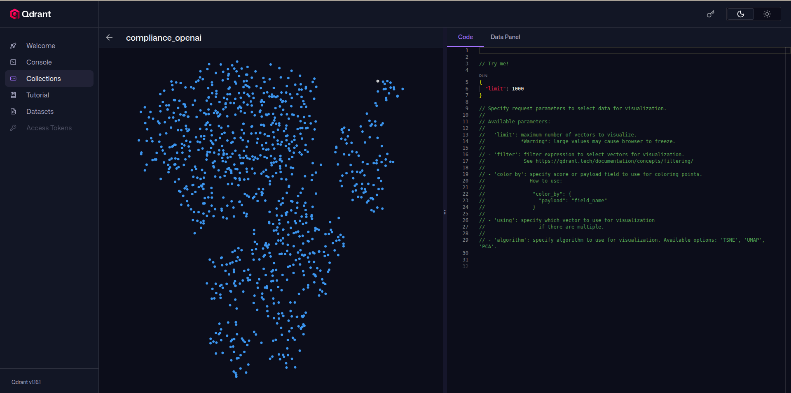
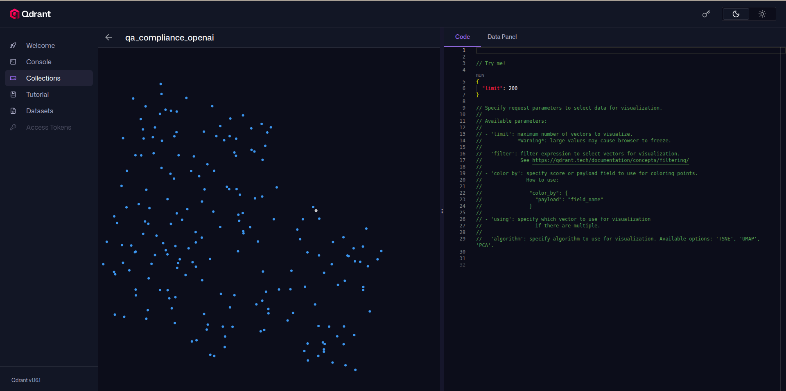
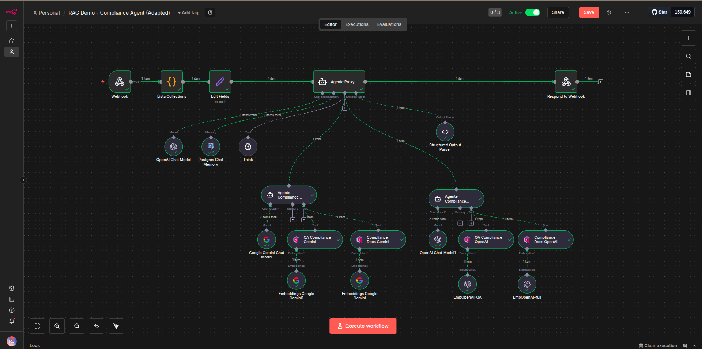
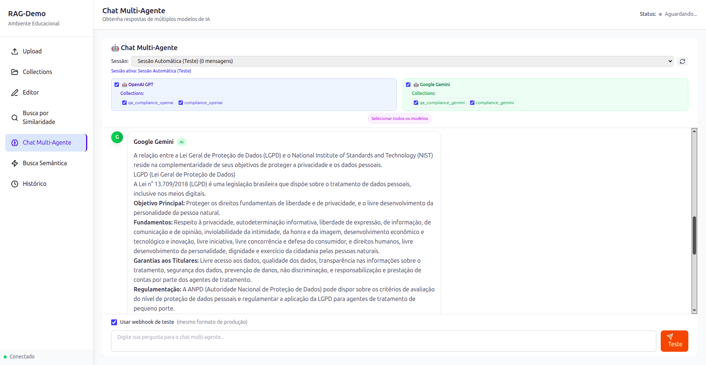
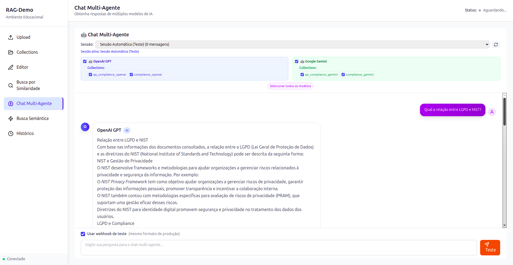

#  Guia Rápido de Execução

Siga os passos abaixo para rodar o projeto.

## 1. Configuração Inicial
1.  **Clone o repositório**.

2.  **Crie o arquivo `.env`**:
    ```bash
    cp .env.example .env
    ```
3.  **Adicione suas chaves de API** (`OPENAI_API_KEY` e `GEMINI_API_KEY`) no arquivo `.env`.

## 2. Instalação e Execução

```bash
./setup.sh
```

## 3. Popular Banco de Dados

```bash
python scripts/populate_db.py
```

Este script irá:
1.  **Ingerir Documentos** (MDs da pasta `uploads/`).
2.  **Importar QA** (Lê o `qa_dataset.json` e popula o banco).
3.  **Criar todas as 4 collections** automaticamente.

---

## 4. Entendendo os Scripts (Opcional)

Para sua referência, aqui está o que cada script faz e a ordem lógica:

### 1. `setup.sh` (Infraestrutura)
*   **O que faz**: Prepara o ambiente. Verifica Docker, cria pastas, arruma permissões e sobe os containers.
*   **Quando rodar**: Na primeira instalação ou se precisar resetar o ambiente (`--clean`).

### 2. `scripts/populate_db.py` (Ingestão Principal)
*   **O que faz**: É o script "tudo-em-um" para restaurar o banco.
    *   Lê os documentos da pasta `uploads/` e vetoriza.
    *   Lê o arquivo `uploads/qa_dataset.json` (backup estático) e importa as perguntas/respostas.
*   **Quando rodar**: Sempre que iniciar o projeto em uma nova máquina ou limpar o banco.

### 3. `scripts/generate_qa_script.py` (Gerador de Inteligência)
*   **O que faz**: Usa IA (LLM) para ler os documentos e **criar novas perguntas e respostas** do zero.
*   **Quando rodar**: Apenas se você quiser gerar novos pares de QA para enriquecer o banco (consome tokens da API). Não é necessário para rodar o demo padrão.

---

## 5. Qdrant

### 5.1. Dashboard do Qdrant



### 5.2. Visualização das Collections

 






## 6. Workflow N8N



## 7. RAG-Demo




